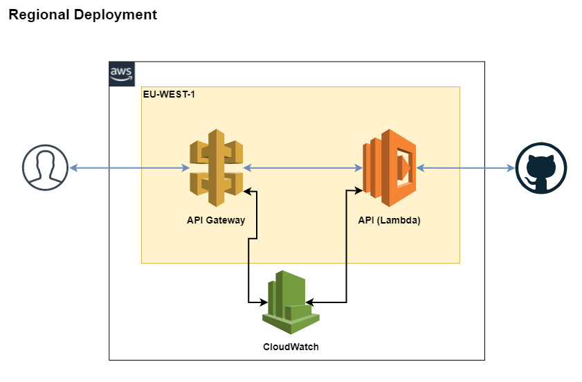
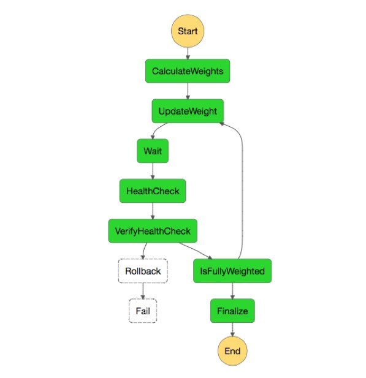

# Description
GHContrib is a REST API to get the top contributors in Github filtered by a location. This code is a proof of concept, the real deployment might need some code modifications that I cover in the deployment section.

## Software needed to build the test
 * docker 19.03.x
 * docker-compose 1.27.x

# How to Test the API
To build the container image and run the application, just run `docker-compose up -d`. There is a `Makefile` provided to ease the task, if you have Make installed, just run `make up`. Once the container is up, issue a request to the api with curl to get the results:

```bash
# curl http://localhost:10000/top/<location>[?items=N]
curl http://localhost:10000/top/Barcelona?items=5
```

# Software desing considerations
The software use

# Production Deployment
A ServerLess approach fits the project requirements and have a lot of flexibility on the system management, deployment and costs. The following diagram shows a possible arquitecture based on AWS Api Gateway, AWS Lambda and Redis. As the Github API has strong rate limits, the system is designed to do the minimum requests to it



Aws Lambda functions are a good fit for the API:
 * Provide high avilability across multiple availability zones with automatic fail-over.
 * They are able to manage up to 1000 concurrent invocations for a single region deployment (Europe).
 * If the system needs more capacity, it can be deployed across multiple regions.
   * A Multi region deployment has some advantages, such as better user experience and a increased system resiliency. The counterpart is that the deployments and management requires more effort.

Api Gateway (ApiGw) acts as a frontend for the lambda function, it defines the API Specification and have some useful features such as caching reponses, managing authorization, api versioning and more. The cache at this stage will save a lot of lambda invocations and will provide a better user experience.

A Redis Cache is used to store the data got from github. Api gateway will cache the responses for a determined request, but if the succesive requests have different parameters for the same location, the cache will miss. When a lambda invocation gets data from github, it stores it in Redis. Next requests for the same location will hit the Redis cache instead of getting the data from Github again. If Redis is not available the system will work fetching all the requests from the api

This system has a good scalablity up to the maximum of concurrent invocations and the resources usage is dynamic. Once the limit is reached, new requests will be throttled. If the system is expected to grow to that limit, the system must be desgined with other components to support more load. As the application is containerized, it can be deployed in a regional kubernetes cluster using the api gateway as a frontend too.

# Observability
All Components use Cloudwatch to ingest its logs and metrics. To ensure the system is working fine there are some basic metrics that need to be monitored.

* **Latency and response time**: The time a client is waiting to get their request processed and the time to process the request and return back the reponse are crucial to ensure a good quality service, if the system is user facing this is also more important.

* **Concurrent invocations:** System capacity should be monitored to ensure the system will be able to manage request spikes and to control at wich capacity the system is working.

* **Error rates:** Control the number of errors the service is throwing could help identify problems. There are some points where the errors should be captured.
  * ApiGw response status codes: 4xx/5xx error codes
  * Lambda invocations error count
  * Lambda logs

* **Cache Hit Ratio:** Cache Hit Ratio should be as high as possible to ensure a good performance.


# Updating the System
Lambda supports blue/green and canary deployments. To deploy a new version, a good approach could be to deploy a new version of the software and then to define a weighted traffic splitting strategy to do the rollout. This can be fully automated with AWS Step functions. The following diagram shows the complete update strategy.




# Other Considerations
 * I used this arquitecture becase I think the serverless approach of AWS really fits very well for system requirements. Other ways with a more cloud agnostic components could be defined for this system, such as deploy the containerized image into any kubernetes cluster. The metrics described and the deployment strategy could be the same with this other approach.

