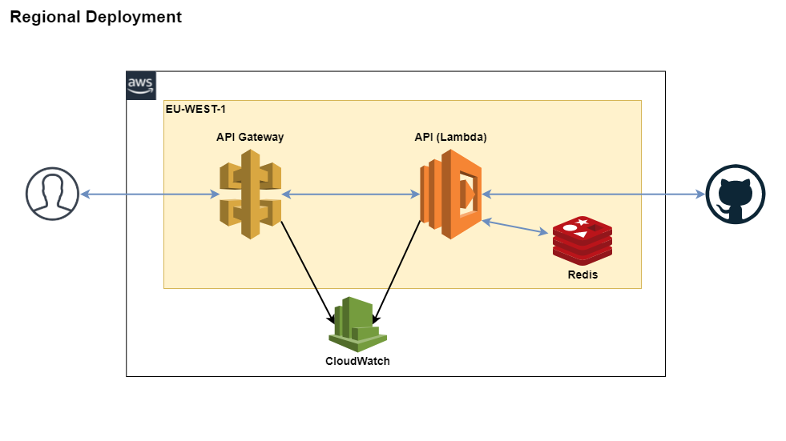

# Description
GHContrib is a REST API that exposes a `/top` endpoint to get the top contributors in Github filtered by a location. This code is a proof of concept, the real deployment might need some code modifications that I cover in the deployment section.

## Software needed to build the test
 * docker 19.03.x
 * docker-compose 1.27.x

# How to Test the API
To build the container image and run the application, just run `docker-compose up -d`. There is a `Makefile` provided to ease the task, if you have Make installed, just run `make up`. Once the container is up, issue a request to the api with curl to get the results:

```bash
# curl http://localhost:10000/top/<location>[?items=N]
curl http://localhost:10000/top/Barcelona?items=5
```

# Production Deployment
A ServerLess approach fits the project requirements and have a lot of flexibility on the system management, deployment and costs. The following diagram shows a basic architecture of the solution based on AWS Api Gateway + AWS Lambda function.



Aws Lambda functions provide high availability across multiple availability zones with automatic fail-over. They are able to manage up to 1000 concurrent invocations for a single region deployment. This quota can be increased if needed. If the system needs more capacity, it can be deployed across multiple regions. A Multi region deployment has some advantages, such as serving the content from the nearest location to the user and a increased system resiliency but it adds some complexity to the system deployment and management.

Api Gateway (ApiGw) acts as a frontend for the lambda function, it defines the API Specification and have some useful features for the service such as caching reponses, authorization, api versioning and more. For the service exposed here that has a strong Rate limitations, the cache will increase the throughput and performance of our system a lot, as we can cache system responses and serve them from the cache during the TTL of the cached responses.

Both compoments use Cloudwatch to ingest its logs and metrics to provide system observability. To ensure the system is working fine there are some basic metrics that need to be monitored.
* **Latency and response time**: The time a client is waiting to get their request processed and the time to process the request and return back the reponse are crucial to ensure a good quality service, if the system is user facing this is also more important.
* **Error rates:** Control the number of errors the service is throwing could help to identify problems. There are some points where the errors should be captured.
  * ApiGw response status codes: 4xx/5xx error codes
  * Lambda invocations error count
  * Lambda logs
* **Cache Hit Ratio:** Cache Hit Ratio should be as high as possible to ensure a good throughput.
* **Concurrent invocations:** System capacity should be monitored to ensure the system will be able to manage request spikes and to control at which capacity the system is working

# Updating the System
Lambda supports blue/green and canary deployments. To deploy a new version, a good approach could be to deploy a new version of the software and to define a weighted traffic splitting strategy to do the rollout. This way, the rollout is made progressively controlling that the new version is behaving as expected. This deployment strategy can be fully automated with AWS Step functions. The following diagram shows the complete update strategy.


# Other Considerations
 * I used this architecture becase I think the serverless approach of AWS fits very well for the system requirements. Other ways with a more cloud agnostic components could be defined for this system, such as deploying the docker image into any kubernetes cluster. The strategies described, could be implemented with other stacks also.
 * The caching strategy described could be improved with other cache systems. Caching user details on Redis (or other key-value storages) will save a lot of api requests to Github
 * The Github Rate of unathenticated users is pretty limited, 60 requests/hour to get the user details. To test the project is possible to run the API with a auth token to get the rate increased to 5000.
 ```
# Get the token from github settings
echo "GITHUB_TOKEN=<YOUR_TOKEN>" > .env
# Change docker-compose file and set the command line with the token option. There is a commented line to switch
    command: ./ghcontrib --verbose
    # command: ./ghcontrib --verbose --github_token=${GITHUB_TOKEN}
 ```